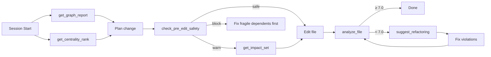

<p align="center">
  
  = 18">
  
  
  
</p>

<h1 align="center">⬡ Gate Keeper</h1>
<p align="center"><strong>Graph-aware quality gates for AI-assisted development.</strong></p>
<p align="center">Every AI agent edit runs through real-time architectural analysis — violations are caught, impact is measured, trends are tracked, and a live knowledge graph keeps the big picture in view. Your AI doesn't just lint files; it understands the <em>codebase</em>.</p>

---

## Why Gate Keeper?

AI agents are great at writing code — but they edit blind. An agent refactoring a utility function has no idea that 12 files depend on it, that it sits at the center of a circular dependency, or that three downstream modules are already fragile. **Gate Keeper is the observability layer that fixes that.**

Every file write is analyzed in real time (TypeScript Compiler API / Roslyn), rated on a 0–10 quality scale, and published to a live force-directed graph — visible in your browser and queryable through a 27-tool MCP server.

---

## Quick Start

```bash
# One command after git clone: install deps + build + hooks + daemon + scan
npm run setup:portable
```

Then open **http://localhost:5378/viz** — and the first time your AI edits a file, it's blocked if 3+ fragile dependents will break, and the post-edit quality check runs automatically.

---

## What Makes It Different

### AI agents see the graph, not just the file

Most code quality tools are linters — they look at one file and flag one violation. Gate Keeper gives AI agents a **full architectural knowledge graph** of the project.

| Without Gate Keeper | With Gate Keeper |
|---|---|
| "This file has rating 8.5 — looks clean, go ahead." | "12 files import this. 3 dependents are already fragile (rating < 6). Renaming will break them — use a deprecation approach." |
| No signal about coupling. | "This is the #1 most-connected node (god node) — changes here impact 28 files directly." |
| No cross-module awareness. | "Your PR connects `auth` → `database` — that's a surprising cross-module dependency. Verify the coupling is intentional." |
| No trend data. | "Rating declined from 10 → 8.5 over the last 20 edits — this file needs care, not more churn." |

The result: agents produce **architecturally coherent** code on the first attempt, not just syntactically correct code.

### Plugin-like, not instruction-dependent

Gate Keeper doesn't rely on the LLM reading an instructions file and remembering what to do. Instead:

| Hook | What it does | Exit code |
|------|-------------|-----------|
| **PreToolUse** (Write/Edit) | Calls `/api/impact-set` — blocks the edit if 3+ fragile dependents will break | `2` (blocking) |
| **PostToolUse** (Write/Edit) | Analyzes the written file — blocks if rating < threshold | `2` (blocking) |
| **SessionStart** | Registers the repo and loads graph context | `0` |
| **UserPromptSubmit** | Ensures daemon is running for the session | `0` |

These hooks are auto-installed by `npx tsx src/cli/setup.ts --claude`. No instructions file required.

### 27 MCP tools across 5 tiers

```
Tier 1 — File Quality (classic linting)
  analyze_file, analyze_code, analyze_many, get_codebase_health, get_quality_rules

Tier 2 — Graph Context & Dependencies
  get_dependency_graph, get_file_context, get_impact_analysis, suggest_refactoring,
  predict_impact_with_remediation, get_violation_patterns

Tier 3 — Token-Efficient Graph Queries
  get_impact_set (100 tokens vs 5000×N files)
  summarize_file (300 tokens vs 5000+ for raw file)
  find_callers (grep without reading files)
  trace_path (coupling analysis in one call)
  check_pre_edit_safety (safe/warn/block verdict)
  get_centrality_rank (god nodes — highest blast radius)

Tier 4 — Knowledge Graph Intelligence
  get_graph_report (narrative: god nodes, surprising connections, suggested questions)
  query_graph (natural language: "what would break if X changed?")
  explain_node (deep file role: centrality, impact, surprising connections)
  export_graph (JSON / GraphML / Neo4j / SVG)
  merge_graphs (union-merge two repos)
  get_graph_viz (standalone interactive HTML with force layout)

Tier 5 — Platform & Workflow
  install_platform (Claude Code, Copilot, Cursor, VS Code, GitHub Action)
  install_git_hooks (post-commit, post-checkout, merge driver)
  pr_review (GREEN/YELLOW/RED per-file risk assessment)
  get_session_metrics (cumulative token savings: ~84% reduction vs naive reads)
```

### Live dashboard — real-time visibility

A force-directed dependency graph updates with every edit. Node colors encode quality (green → red), shapes encode language, and size encodes complexity. Click any node to drill into violations, dependencies, and rating history.

---

## One-Shot Setup

After cloning the repo anywhere on disk:

```bash
npm run setup:portable
```

This single command (which runs `npm run build:all && npx tsx src/cli/setup.ts --all`) resolves all paths dynamically — it works from any filesystem location on any machine.

Or run the setup tool directly for specific targets:

```bash
npx tsx src/cli/setup.ts --all              # everything at once
npx tsx src/cli/setup.ts --claude           # Claude Code hooks only
npx tsx src/cli/setup.ts --copilot          # Copilot / VS Code MCP only
```

Whichever way you call it, `--all` runs these steps:

| Step | Produces |
|------|----------|
| `.graphifyignore` | 8 sensible exclusion patterns (generated files, build output, deps) |
| **Claude Code hooks** | PreToolUse (blocks risky edits) + PostToolUse (quality gate) + SessionStart + UserPromptSubmit |
| **VS Code / Copilot** | `.vscode/mcp.json` — auto-discovers MCP server |
| **Cursor** | `.cursorrules` with workflow instructions |
| **GitHub Actions** | `.github/workflows/gate-keeper.yml` — quality gates in CI |
| **Git hooks** | post-commit + post-checkout (auto-analyze on commit) |
| **Daemon + scan** | Starts daemon, runs initial graph scan |

Or install for specific platforms — same commands as listed above.

---

## Claude Code Setup

```bash
npx tsx src/cli/setup.ts --claude
```

This writes all four hooks to `~/.claude/settings.json`:

```json
{
  "hooks": {
    "PreToolUse": [
      {
        "matcher": "Write|Edit",
        "hooks": [{ "type": "command", "command": "node /path/to/gate-keeper/dist/hook-pre-tool-use.js" }]
      }
    ],
    "PostToolUse": [
      {
        "matcher": "Write|Edit",
        "hooks": [{ "type": "command", "command": "node /path/to/gate-keeper/dist/hook-receiver.js" }]
      }
    ],
    "SessionStart": [
      { "hooks": [{ "type": "command", "command": "node /path/to/gate-keeper/dist/hook-receiver.js" }] }
    ],
    "UserPromptSubmit": [
      { "hooks": [{ "type": "command", "command": "node /path/to/gate-keeper/dist/hook-receiver.js" }] }
    ]
  }
}
```

The **PreToolUse** hook blocks every Write/Edit that would impact 3+ fragile dependents. The **PostToolUse** hook blocks every Write/Edit that produces code below the quality threshold. No instructions file needed — the hooks enforce the gates.

---

## GitHub Copilot / VS Code Setup

```bash
npx tsx src/cli/setup.ts --copilot --vscode
```

This creates `.vscode/mcp.json` for MCP auto-discovery and `.github/copilot-insights.yml` which registers `graph-tools` as a Copilot workspace chat participant.

---

## MCP Server Reference

Gate Keeper ships with a 27-tool MCP server over stdio. Any MCP-compatible client (Claude Code, Copilot, Cursor, custom hosts) connects instantly.

### Key agent workflows



### How to test the MCP server

```bash
# List all 27 tools
echo '{"jsonrpc":"2.0","id":1,"method":"tools/list","params":{}}' | node dist/mcp/server.js

# Analyze a file
echo '{"jsonrpc":"2.0","id":2,"method":"tools/call","params":{"name":"analyze_file","arguments":{"file_path":"/path/to/file.ts"}}}' | node dist/mcp/server.js

# Check pre-edit safety
echo '{"jsonrpc":"2.0","id":3,"method":"tools/call","params":{"name":"check_pre_edit_safety","arguments":{"file_path":"/path/to/file.ts","change_description":"refactor login handler"}}}' | node dist/mcp/server.js

# Get impact set (depth 2)
echo '{"jsonrpc":"2.0","id":4,"method":"tools/call","params":{"name":"get_impact_set","arguments":{"file_path":"/path/to/file.ts","depth":2}}}' | node dist/mcp/server.js

# Query the graph
echo '{"jsonrpc":"2.0","id":5,"method":"tools/call","params":{"name":"query_graph","arguments":{"query":"what are the god nodes?"}}}' | node dist/mcp/server.js

# Get the narrative graph report
echo '{"jsonrpc":"2.0","id":6,"method":"tools/call","params":{"name":"get_graph_report"}}' | node dist/mcp/server.js
```

---

## Dashboard

Open **http://localhost:5378/viz** after starting the daemon.

```
┌─────────────────────────────────────────────┐
│  ⬡ Gate Keeper   ● connected   Last: App.tsx │
│                           48 files · Arch: 7.2/10 │
├──────────────────────────────┬──────────────┤
│                              │ Architecture │
│   Force-directed dependency  │ Health       │
│   graph                      │              │
│                              │ Rating 7.2   │
│   ● circle = TS/JS           │ Files    48  │
│   ■ square = C#              │ Cycles    0  │
│   ▲ triangle = TSX/JSX       │ Violations 3 │
│                              │              │
│   ■ ≥8  ■ ≥6  ■ ≥4  ■ <4   │ Hotspots ... │
└──────────────────────────────┴──────────────┘
```

- **Node shape**: language (circle = TS/JS, square = C#, triangle = TSX/JSX)
- **Node color**: rating (green ≥8, yellow ≥6, orange ≥4, red <4)
- **Node size**: lines of code
- Click any node to drill into violations, metrics, dependencies, and rating history

### REST API

| Endpoint | Description |
|----------|-------------|
| `GET /api/graph` | Full graph data (nodes + edges) |
| `GET /api/impact-set?file=&repo=&depth=` | BFS impact set with verdict (safe/warn/block) |
| `GET /api/hotspots` | Top 5 lowest-rated files |
| `GET /api/status` | Daemon status, overall rating, cycle count |
| `GET /api/cycles` | All circular dependency cycles |
| `GET /api/trends?file=&repo=` | Rating history for a file |
| `GET /api/file-detail?file=&repo=` | Full analysis + breakdown + git diff |
| `GET /api/repos` | All registered repositories |

---

## Features

- **27 MCP tools** across file quality, graph context, token-efficient queries, knowledge graph intelligence, and platform workflow
- **Real-time analysis** — every Write/Edit triggers AST-level analysis via TypeScript Compiler API
- **PreToolUse blocking hook** — prevents edits that risk cascading failures before they happen
- **Knowledge graph** — god nodes, surprising cross-module connections, suggested questions, natural language queries
- **Interactive HTML visualization** — force-directed layout, search, click-to-detail, no CDN dependencies
- **SVG / GraphML / Neo4j / JSON export** — plug into Gephi, Neo4j, or custom tools
- **Multi-repo merge** — union-merge graphs from different repos with conflict resolution (takes min rating)
- **Circular dependency detection** — iterative DFS with per-cycle scoring (−1.0 per cycle)
- **Rating history & trends** — per-file append-only log
- **Dual-platform hooks** — Claude Code (native hooks) + GitHub Copilot (MCP)
- **Copilot chat participant** — `.github/copilot-insights.yml` registers graph-tools
- **Token efficiency** — one graph query (~100 tokens) replaces reading 5+ files (~25,000 tokens)
- **Multi-language** — TypeScript, JavaScript, React/JSX, C# (Roslyn or text fallback)
- **Configurable quality gates** — `minRating` threshold, customizable `.graphifyignore` exclusion
- **Interactive REPL** — `npm run dev -- --query` for ad-hoc graph queries
- **Watch mode** — `npm run dev -- --watch` polls for changes and re-analyzes
- **CI-ready** — GitHub Action workflow, PR risk assessment tool

---

## Architecture

```
Claude Code                              VS Code / Copilot
    │                                          │
    │  PreToolUse hook (block if risky)         │  MCP tools (27)
    │  PostToolUse hook (block if low qual)    │
    ▼                                          ▼
┌──────────────────────────────────────────────────┐
│              hook-receiver.ts                    │  < 100 ms
│  hook-pre-tool-use.ts (PreToolUse gate)          │  fire-and-forget
│  POST /analyze → daemon                          │  exit code 2 = block
└──────────────────────┬───────────────────────────┘
                       │ HTTP :5379
                       ▼
┌──────────────────────────────────────────────────┐
│                  daemon.ts                       │
│  UniversalAnalyzer → RatingCalc → SqliteCache    │
│  DependencyGraph (in-memory)                     │
│  WatchMode (--watch flag)                        │
│  Query REPL (--query flag)                       │
└──────────┬───────────────────────────────────────┘
           │  WebSocket + HTTP :5378
           ▼
┌──────────────────────┐    ┌──────────────────────────┐
│  React Dashboard     │    │  MCP Server (27 tools)   │
│  http://localhost    │    │  stdio transport          │
│  :5378/viz           │    │  Graph query engine       │
└──────────────────────┘    └──────────────────────────┘
```

### Key files

| Path | Purpose |
|------|---------|
| `src/hook-receiver.ts` | PostToolUse hook — exits < 100ms, fires analysis |
| `src/hook-pre-tool-use.ts` | PreToolUse hook — blocks edits to high-risk files (exit 2) |
| `src/daemon.ts` | Long-lived process, ports 5378/5379 |
| `src/cli/setup.ts` | One-shot `--all` installer |
| `src/cli/query-repl.ts` | Interactive graph query REPL |
| `src/daemon/watch-mode.ts` | File watcher for auto re-analysis |
| `src/graph/graph-algorithms.ts` | BFS, centrality (degree + betweenness), path tracing |
| `src/graph/relationship-extractor.ts` | AST-based function calls, heritage, why-comments |
| `src/graph/surprising-connections.ts` | Cross-module coupling detection |
| `src/graph/question-suggester.ts` | Auto-generated graph questions |
| `src/graph/graph-report.ts` | Narrative Markdown report generator |
| `src/graph/graph-export.ts` | JSON / GraphML / Neo4j / SVG export + merge |
| `src/graph/graphify-ignore.ts` | .graphifyignore parser (gitignore-compatible) |
| `src/graph/global-graph.ts` | Cross-repo index (~/.gate-keeper/global-graph.json) |
| `src/mcp/server.ts` | MCP server with 27 tool definitions |
| `src/mcp/handlers/graph-query.ts` | 7 token-efficient query handlers |
| `src/mcp/handlers/graph-intelligence.ts` | 6 knowledge graph + viz handlers |
| `src/mcp/handlers/pr-review.ts` | PR risk assessment |
| `src/mcp/token-tracker.ts` | Session token savings tracking |
| `src/mcp/cache-preload.ts` | Preloads graph data on MCP session start |
| `src/viz/graph-viz.ts` | Standalone interactive HTML visualizer |
| `src/github/commenter.ts` | PR comment formatter |
| `src/github/app.ts` | GitHub App webhook skeleton |

---

## Quality System

Each file is rated **0–10** (higher is better).

| Deduction | Condition |
|-----------|-----------|
| −1.5 per `error` violation | missing `key`, empty catch |
| −0.5 per `warning` violation | `any` type, god class, long method, tight coupling |
| −0.1 per `info` violation | `console.log`, magic number |
| −2.0 / −1.0 | Cyclomatic complexity > 20 / > 10 |
| −2.0 / −0.5 | Import count > 30 / > 15 |
| −1.5 / −0.5 | Lines of code > 500 / > 300 |
| −1.0 per cycle | Circular dependencies |
| −2.5 / −2.0 / −1.0 | Test coverage < 30% / < 50% / < 80% |

### Violation reference

**TypeScript / JavaScript / React (`.ts`, `.tsx`, `.js`, `.jsx`):**

| Violation | Severity | What it catches |
|-----------|----------|-----------------|
| `missing_key` | **error** | JSX elements in `.map()` missing the `key` prop |
| `empty_catch` | **error** | Empty catch blocks |
| `hook_overload` | warning | React component with > 7 hooks |
| `duplicate_hooks` | warning | Same hook called more than once |
| `any_type` | warning | Explicit `any` — use specific types or `unknown` |
| `inline_handler` | info | Inline arrow functions in JSX event props |
| `console_log` | info | `console.log` in production code |

**C# (`.cs`):**

| Violation | Severity | What it catches |
|-----------|----------|-----------------|
| `empty_catch` | **error** | Empty catch block |
| `god_class` | warning | Class with > 20 methods |
| `long_method` | warning | Method body > 50 lines |
| `tight_coupling` | warning | Constructor with > 5 parameters |
| `magic_number` | info | Unnamed numeric constants |

---

## Development

```bash
npm run build              # Compile src/ → dist/
npm run build:dashboard    # Build dashboard
npm run build:all          # Build everything
npm run daemon             # node dist/daemon.js
npm run dev                # npx tsx src/daemon.ts
npm run dev -- --watch     # Watch mode (poll for changes)
npm run dev -- --query     # Interactive query REPL
npm run mcp                # node dist/mcp/server.js
npm run mcp:dev            # npx tsx src/mcp/server.ts
npm test                   # Run tests (967 across 37 suites)
npm run test:coverage      # Tests with coverage report
npm run test:watch         # Watch mode for tests
```

### Ports & files

| Resource | Purpose |
|----------|---------|
| `:5378` | Dashboard HTTP + WebSocket |
| `:5379` | Daemon IPC (localhost only) |
| `~/.gate-keeper/cache.db` | SQLite — analyses, rating history, repos |
| `~/.gate-keeper/config.json` | Change `minRating` (default 6.5) |
| `~/.gate-keeper/daemon.pid` | PID file for liveness checks |
| `~/.gate-keeper/global-graph.json` | Cross-repo merged graph index |
| `dashboard/dist/` | Built React app, served at `/viz/` |

---

## License

MIT — see [LICENSE](LICENSE).
